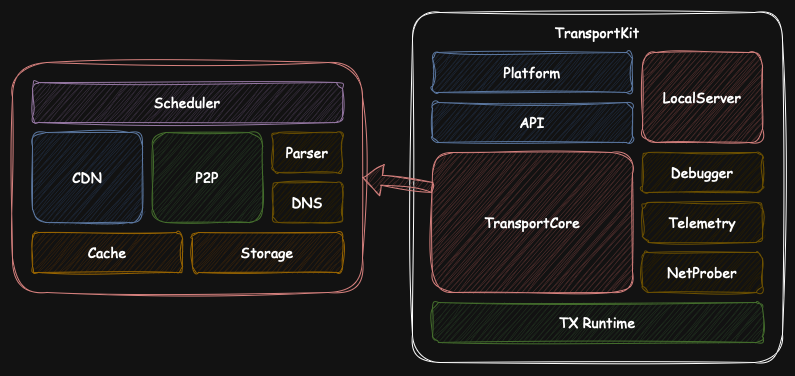

# TransportKit

**T**ransport**K**it provides data transfer (both download and upload) acceleration, Peer-to-peer data transfers, and local proxy services.

> The project is still being early developed, do not use it for any purpose whatsoever.
>

What's TransportKit used for?

Data transmission serves as the foundation for nearly all softwares – whether downloading games from Steam, streaming video content, or requesting resources via HTTP protocols on the web. TransportKit is trying to be such the one your software can be built upon to deliver data end to end as fast as your band-width allows.

## Architecture



## Contents

- [Bazel](./Bazel) - Bazel configurations
- [CMake](./CMake) - CMake configurations
- [Examples](./Examples) - Usage examples
- [Scripts](./Scripts) - Scripts to build TransportKit
- [Source](./Source)
  - [API](./Source/API) - TransportKit C API
  - [TransportCore](./Source/TransportCore) - Data transfer core
  - [LocalServer](./Source/LocalServer) - Local proxy server
  - [Debugger](Source/Debugger) - Debug server
  - [Telemetry](Source/Telemetry) - Telemetry client
  - [NetProber](Source/NetProber) - P2P NetProber
  - [ThirdParty](./Source/ThirdParty) - Third-party libraries
  - [TX](./Source/TX) - Foundation library  (**T**emplate e**X**tended)
- [Platform](./Source/Platform) - Bindings to the TransportKit C API, e.g. Java for Android 
- [Tests](./Tests) - Feature/Integrated tests

## Develop

TransportKit uses [CMake](https://cmake.org) to generate building configurations on different platforms.

### Develop with CLion (Preferred)

Open the project directory, and that's it.


### Develop with VSCode

Open the project directory with VSCode, and you'll need at least these plugins:

- [Clangd](https://marketplace.visualstudio.com/items?itemName=llvm-vs-code-extensions.vscode-clangd)
- [CMake Tools](https://marketplace.visualstudio.com/items?itemName=ms-vscode.cmake-tools)


### Develop with Xcode

Run the command below to generate project configurations for Xcode.

```bash
cmake -G Xcode -B build-xcode .
```

And then use Xcode to open the generated file named `build-xcode/TransportKit.xcodeproj`.


## Code Style

The project basically follows [Google C++ Style Guide](https://google.github.io/styleguide/cppguide.html), along with some of my personal coding preferences.


## Credits

- https://github.com/webkit/webkit
- https://github.com/curl/curl
- https://webrtc.googlesource.com
